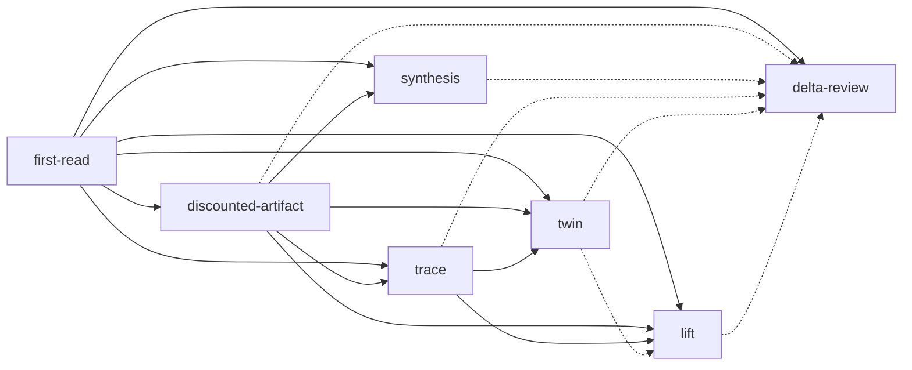

# Passes

The full map of the repo-review series: every pass, its version, what it depends
on, when it stops early, and what it catches. It exists so a human (or an agent)
can learn the shape of the series without grepping seven frontmatters.

The seven template frontmatters are the **single source of truth**. This file is
a hand-authored, drift-checked *view* of them — never generated. `tools/lint_pass_map.py`
fails the build if any machine-derivable cell below disagrees with frontmatter.
The `catches` column is human prose and is not guarded.

## The map

| pass_id | name | version | prerequisites | recommended | output_kind | terminates_early_when | catches |
|---------|------|---------|---------------|-------------|-------------|-----------------------|---------|
| first-read | The First Read | 7 | — | — | prose-with-yaml-appendix | never | The first impression — coverage-driven, opinionated, blind to its own blind spots |
| discounted-artifact | The Discounted Artifact | 7 | first-read | — | prose-with-yaml-appendix | never | The largest or most formal artifact the first pass under-read |
| synthesis | The Synthesis | 7 | first-read, discounted-artifact | — | prose-with-yaml-appendix | never | Optional composition of the first two passes into one current judgment |
| trace | The Trace | 7 | first-read, discounted-artifact | — | prose-with-yaml-appendix | repo-has-no-load-bearing-obligation | Whether the repo's stated obligations are actually enforced by the running code |
| twin | The Twin | 7 | first-read, discounted-artifact, trace | — | prose-with-yaml-appendix | never | What the repo's choices look like next to one adjacent repo with a different mental model |
| lift | The Lift | 7 | first-read, discounted-artifact, trace | twin | prose-with-yaml-appendix | repo-yields-no-extractables | What can become useful as a standalone artifact |
| delta-review | The Delta Review | 4 | first-read | discounted-artifact, synthesis, trace, twin, lift | prose-with-yaml-appendix | never | Which prior judgments need to move after the repo changes |

Cell conventions (the guarded columns obey these exactly, so the lint can parse
them): an empty list renders as `—`; a non-empty list renders as its items joined
by a comma and a single space, in frontmatter order. List columns
(`prerequisites`, `recommended`) compare order-insensitively; scalar columns
compare as exact strings.

## Prerequisite DAG

Solid arrows are hard `prerequisites`; dashed arrows are
`recommended_prerequisites`. This diagram is illustrative — the table above is the
authoritative, drift-guarded surface.

Passes 01–04 are diagnostic, 05 is extractive, 02.5 is compositional and
optional, and 06 (Delta Review) is an out-of-band incremental update — not part of
the base sequence. See [`README.md`](../README.md) for the prose account and
[`STRUCTURED_OUTPUT_SCHEMA.md`](STRUCTURED_OUTPUT_SCHEMA.md) for the output schema.
